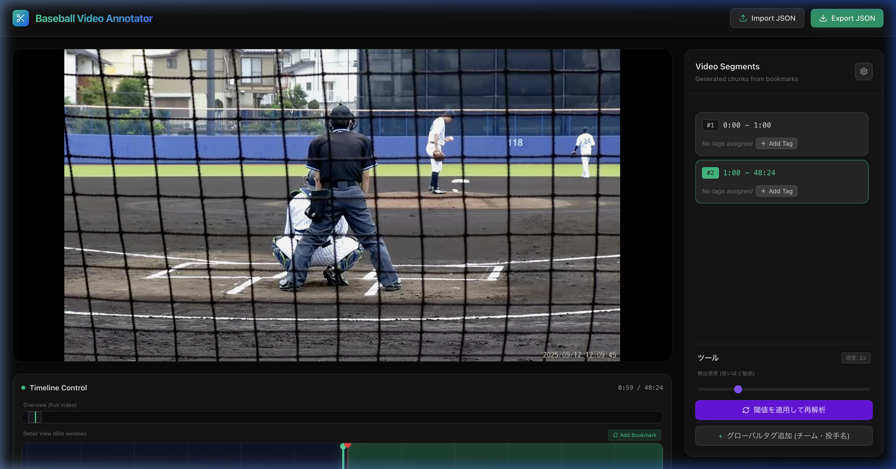
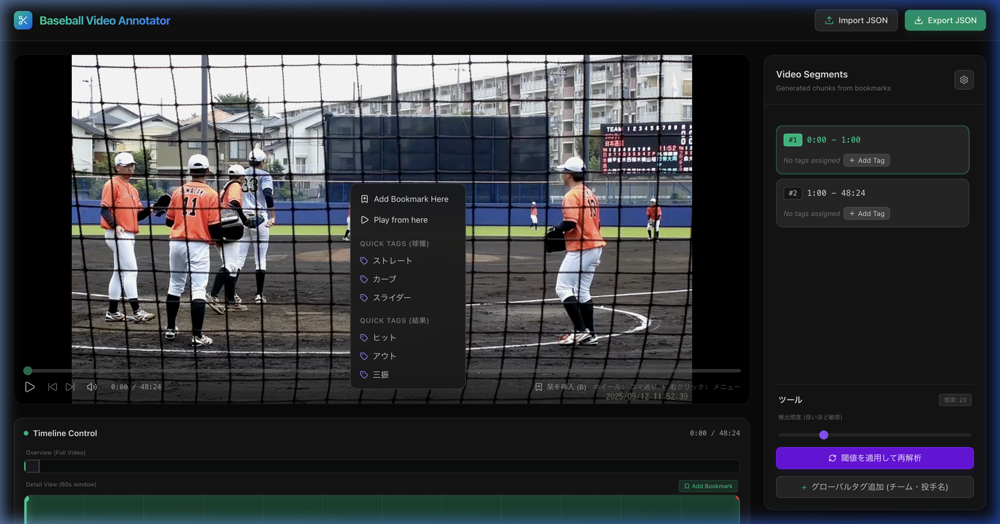

# Baseball Video Annotator

野球の試合映像を解析し、一球ごとのセグメント分割と詳細なタグ付けを効率化するためのWebアプリケーションです。

## 主な機能

### 1. 動画解析と自動カット検出
- 動画ファイルをドラッグ＆ドロップするだけで読み込み可能。
- 撮影の停止・再開による「フレームの飛び」をバックエンドで自動検出し、ブックマーク（栞）を自動挿入します。
- **検出感度調整:** サイドバーまたは設定画面から感度（閾値）を調整し、再解析が可能です（デフォルト: 23.0）。


*メイン画面: 動画プレイヤー、タイムライン、および右側のセグメントリスト*

### 2. インタラクティブなタイムライン
- **2段階ビュー:** 動画全体を表示する `Overview` と、現在位置周辺を拡大表示する `Detail` ビューを搭載。
- **正確なシーク:** マウスホイールを回転させることで、フレーム単位（1/30秒）の微調整が可能です。

### 3. セグメント（チャンク）操作
右側の `Video Segments` リストから各投球/シーンを選択できます。選択された範囲はタイムライン上で緑色にハイライトされます。


*セグメント選択時の表示: 指定範囲が緑色で強調されます*

### 4. 動的タグ管理システム
- **カスタムカテゴリ:** 「球種」「結果」だけでなく、「カウント」「判定」など任意のカテゴリを自由に追加できます。
- **JSONインポート:** `tags.json` をアップロードすることで、チーム独自のタグ体系を一括で設定できます。
- **クイックタグ:** 右クリックコンテキストメニューから、選択中のセグメントに対して瞬時にタグを付与できます。


*右クリックメニュー: 栞の追加やタグ付けが素早く行えます*

## タグ設定ファイル (tags.json) の作成方法

設定画面からインポートできる `tags.json` を自作することで、独自のタグ体系を構築できます。

### JSONの構造
各カテゴリ（球種、カウント等）をキーとし、その中に `label`（表示名）と `tags`（タグの配列）を記述します。

### 雛形 (Template)
以下の内容を `tags.json` として保存し、設定画面からアップロードしてください。

```json
{
  "pitch_type": {
    "label": "球種",
    "tags": ["ストレート", "カーブ", "スライダー", "フォーク"]
  },
  "count": {
    "label": "カウント",
    "tags": ["0-0", "1-0", "0-1", "1-1", "2-1", "1-2", "2-2", "3-2"]
  },
  "result": {
    "label": "結果",
    "tags": ["ストライク", "ボール", "三振", "ヒット", "アウト"]
  }
}
```

## 操作ガイド

### 栞（ブックマーク）の管理
このツールでは、栞によって動画をセグメント（一球ごとの区切り）に分割します。

- **栞の挿入 (`B`):** 現在の再生位置に新しい区切りを追加します。
- **栞の削除 (`Shift + B`):** 
  - **現在選択しているセグメント（チャンク）の開始位置にある栞を削除します。**
  - これにより、前のセグメントと結合することができます。
- **Undo (`Ctrl + Z` / `Cmd + Z`):** 誤って削除した栞を復元します。

### キーボードショートカット
- `Space`: 再生 / 一時停止
- `B`: 栞を挿入
- `Shift + B`: 選択中セグメントの開始栞を削除
- `←` / `→` または `[` / `]`: 前後の栞へジャンプ

## 使い方

1. `Select Video File` ボタンから試合映像を選択します。
2. 自動解析が走り、カット位置に自動的に栞が打たれます。
3. タイムラインやショートカットキーで各投球の開始位置を確認・微調整します。
4. 右クリックメニューまたはサイドバーのリストからタグを付けます。
5. 画面右上の `Export JSON` ボタンでアノテーションデータを保存します。

---
[View Live Demo](https://tajmahal.mond.jp/research/video_analyzer/)
